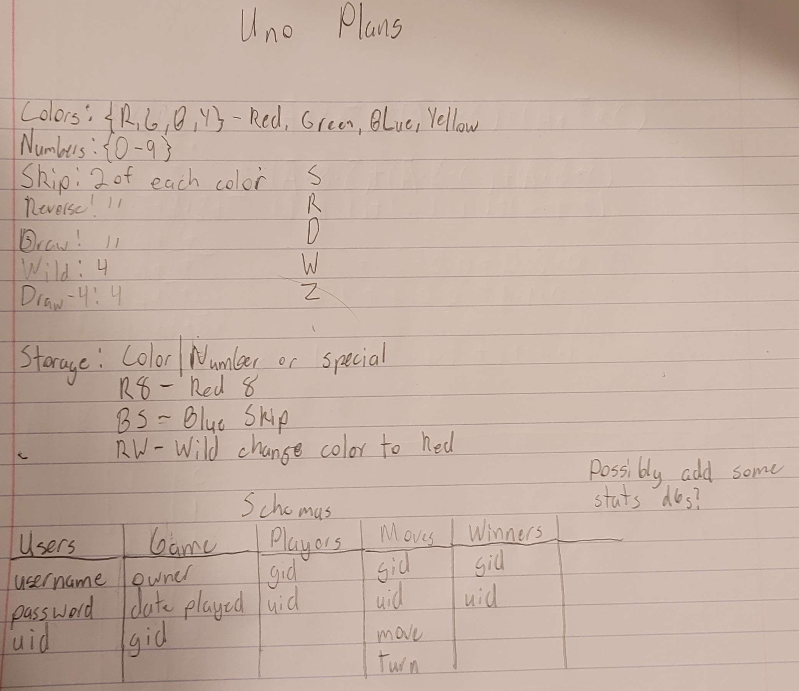

### General description

This will be a website where people can log on to play **Uno**.

The user will connect to the system in order to play a game of **Uno**.

Players can connect with each other to play together, or with AI.

### The Front End

There will be a login page that takes a username and password. It will also allow for the creation of a new account.

The main page will be the **Uno** game window, using **React**.

### The web server.

The server will be running **NodeJS** and **SocketIO** on bare metal.

### The database

The DBMS will be **MySQL** on bare metal.

